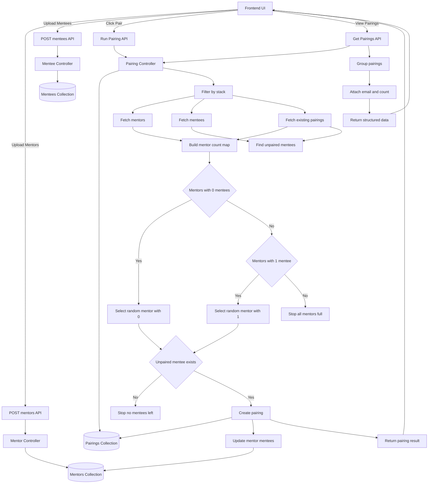

# Mentorship Matching System

A backend platform designed to automate mentor–mentee pairing for educational programs.

## Impact

This system replaced a manual mentor assignment process previously conducted using paper and pen, improving efficiency and fairness in mentee distribution.

## Key Features
- Automated mentor–mentee pairing
- Stack-based matching (Frontend, Backend, Design)
- Availability-aware pairing
- Balanced mentor load (max two mentees per mentor)
- Cohort-based matching logic

## ⚙️ Architecture Overview

The system uses a fair, incremental pairing algorithm that:
- Assigns one mentee per request
- Ensures every mentor gets at least one mentee before any gets a second
- Uses randomized selection for fairness
- Maintains state in MongoDB for consistency

---

## 🏗️ System Architecture

# Mentorship Pairing System Architecture

---

## Matching Algorithm
``
The system pairs mentors and mentees using the following logic:

1. Retrieve mentees without mentors
2. Match them with mentors with the lowest mentee count
3. Ensure stack compatibility
4. Distribute mentees evenly
5. Repeat until all mentees are paired

## Real-world Usage

The system has been used in a mentorship program with:

- Over **70 mentees** per cohort
- Over **40 mentors** per cohort
- Multiple technical stacks

It significantly reduced manual coordination and pairing errors.

## Tech Stack

- Node.js
- Express.js
- MongoDB
- REST APIs

## Future Improvements

- Admin dashboard
- Mentor availability tracking
- Matching analytics
- Cohort management
- Open-source matching module
