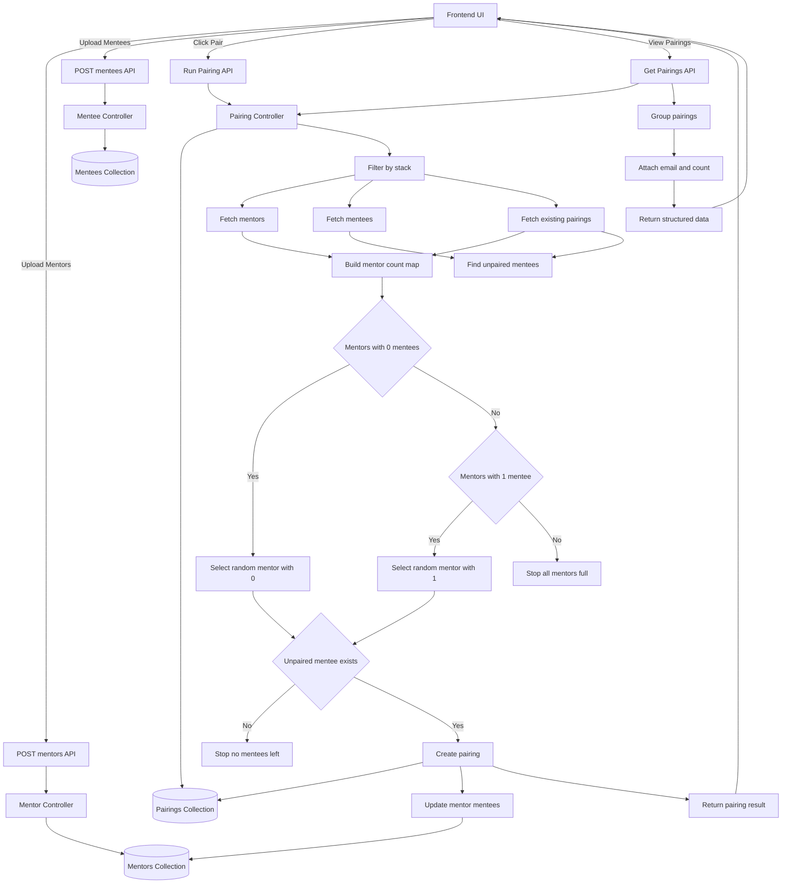

# Mentorship Pairing System Architecture

```mermaid
flowchart TD

A[Frontend UI] -->|Upload Mentors| B[POST mentors API]
A -->|Upload Mentees| C[POST mentees API]
A -->|Click Pair| D[Run Pairing API]
A -->|View Pairings| E[Get Pairings API]

B --> F[Mentor Controller]
C --> G[Mentee Controller]
D --> H[Pairing Controller]
E --> H

F --> I[(Mentors Collection)]
G --> J[(Mentees Collection)]
H --> K[(Pairings Collection)]

H --> L[Filter by stack]
L --> M[Fetch mentors]
L --> N[Fetch mentees]
L --> O[Fetch existing pairings]

M --> P[Build mentor count map]
N --> Q[Find unpaired mentees]
O --> P
O --> Q

P --> R{Mentors with 0 mentees}
R -->|Yes| S[Select random mentor with 0]
R -->|No| T{Mentors with 1 mentee}

T -->|Yes| U[Select random mentor with 1]
T -->|No| V[Stop all mentors full]

S --> W{Unpaired mentee exists}
U --> W

W -->|No| X[Stop no mentees left]
W -->|Yes| Y[Create pairing]

Y --> K
Y --> Z[Update mentor mentees]

Z --> I

Y --> AA[Return pairing result]
AA --> A

E --> AB[Group pairings]
AB --> AC[Attach email and count]
AC --> AD[Return structured data]
AD --> A
```